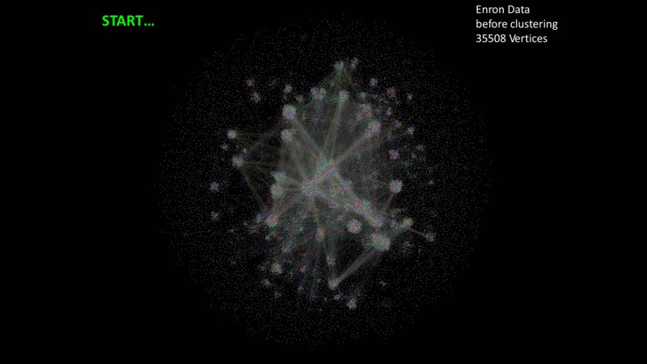
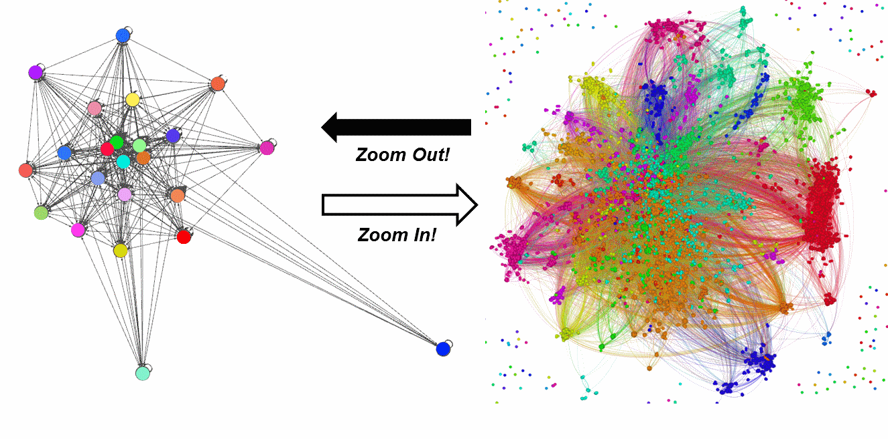

Distributed Louvain Modularity
==============================

<i>Community Assignment phases of Louvain Modularity when applied to the [Enron Email Data Set](https://www.cs.cmu.edu/~enron/).  In this image each node repsents an email address and color represents community.</i>
### What is it?
This project is an implementation of the Louvain Community Detection algorithm described in ["Fast unfolding of communities in large networks"](http://arxiv.org/pdf/0803.0476.pdf) which:

1. assigns communities to nodes in a graph based on graph structure and statistics and 
2. compresses the community-tagged graph into a smaller one.

This process can then be repeated to build several community-aggregated versions of the same original graph.

#####[Interested in learing more?](https://github.com/Sotera/distributed-louvain-modularity/wiki/Explain-%22Distributed-Louvain-Modularity%22.)

### Why do I care?
Identifying communities in large networks based on graph structure is difficult to eyeball and computationally hard, but is  useful in understanding structure and strength of community metrics which may adhere to real-world relationships or constraints.  Furthermore, big-data size graph compression allows for analysis of networks at various aggregation levels which is useful in guided network analysis and drill-down operations.

### How do I get it?
#####It's easy! - [click here](https://github.com/Sotera/distributed-louvain-modularity/wiki/How-do-I-get-and-install-it%3F) if you're already sold and want it now!

### Get any other questions answered at our [wiki!](https://github.com/Sotera/distributed-louvain-modularity/wiki)
